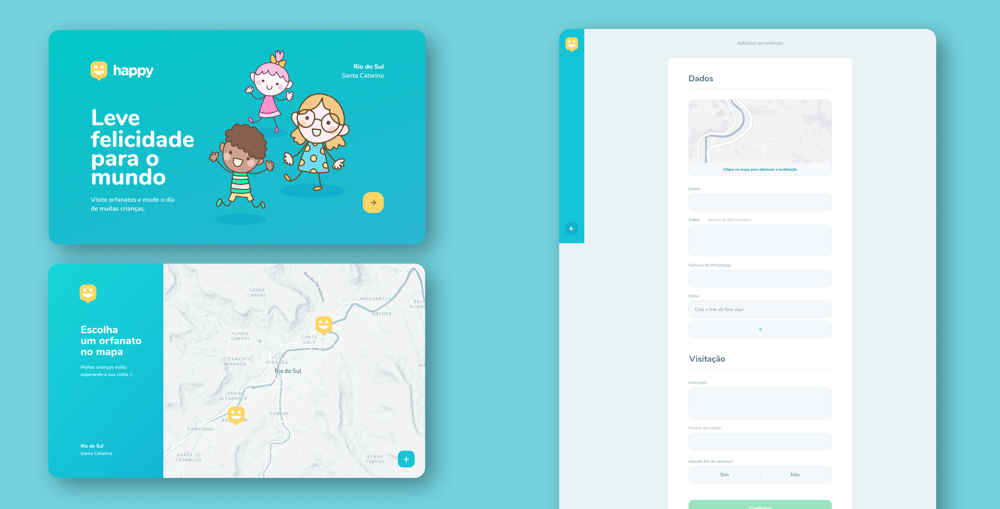
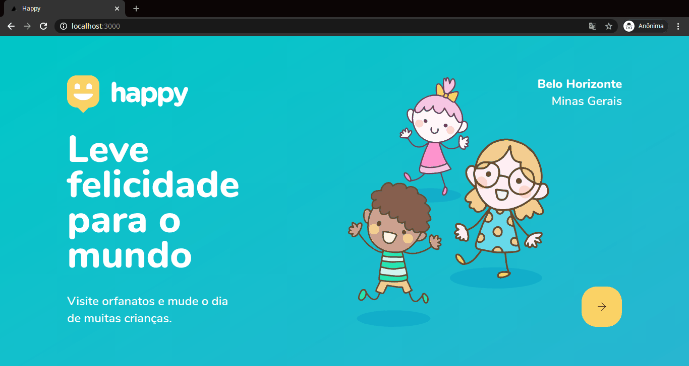

<!-- Logo -->
<p align="center">
  
</p>

<!-- Badges -->
<p align="center">
  
  
  
  
  
</p>

<!-- Indice-->
<p align="center">
 <a href="#computer-sobre">Sobre</a> •
 <a href="#gear-funcionalidades">Funcionalidades</a> •
 <a href="#wrench-tecnologias-utilizadas">Tecnologias</a> •
 <a href="#art-layout">Layout</a> •  
 <a href="#movie_camera-preview">Preview</a> •
 <a href="#rocket-executando-o-projeto">Executando</a> •
 <a href="#memo-licença">Licença</a>
</p>

## :computer: Sobre

O **Happy** foi criado com o intuito de ser uma aplicação que conecta orfanatos e pessoas com interesse de adotar crianças e adolescentes. Ele foi um projeto desenvolvido durante a **Next Level Week 3**, um evento organizado pela Rocketseat que busca no período de uma semana a criação de uma aplicação completa, englobando as partes web, mobile e server.

## :gear: Funcionalidades

### Web

- [x] Cadastro de orfanatos
  - [x] Dados do orfanato
    - [x] Nome
    - [x] Sobre
    - [x] Número de WhatsApp
    - [x] Fotos
  - [x] Visitação
    - [x] Instruções
    - [x] Horário das visitas
    - [x] Se atende ou não final de semana
- [x] Visualização de orfanatos

### Mobile

- [x] Visualização de orfanatos

## :wrench: Tecnologias Utilizadas

<table>
  <tbody>
    <tr>
      <td align="center">
        
        <p>HTML</p>
      </td>
      <td align="center">
        
        <p>CSS</p>
      </td>
      <td align="center">
        
        <p>Typescript</p>
      </td>
      <td align="center">
        
        <p>React</p>
      </td>
      <td align="center">
        
        <p>React Native</p>
      </td>
      <td align="center">
        
        <p>Node.js</p>
      </td>
      <td align="center">
        
        <p>SQLite</p>
      </td>
      <td align="center">
        
        <p>TypeORM</p>
      </td>
    </tr>
  </tbody>
</table>

## :art: Layout

### Web - [Figma](https://www.figma.com/file/yFTs0O461qSE3iuXSlknN5/Happy-Web?node-id=0%3A1)



### Mobile - [Figma](https://www.figma.com/file/yFTs0O461qSE3iuXSlknN5/Happy-Web?node-id=49523%3A62)


## :movie_camera: Preview

### Web



### Mobile


## :rocket: Executando o projeto

### Pré-requisitos

Para executar o projeto é necessário ter instalado as seguintes ferramentas:

<table>
  <tbody>
    <tr>
      <td align="center">
        <a href='https://git-scm.com/downloads' target='_blank'>
          
          <p>GIT</p>
        </a>
      </td>
      <td>
        <a href='https://git-scm.com/downloads' target='_blank'>
          
          <p>Node.js</p>
        </a>
      </td>
    </tr>
  </tbody>
</table>

### Rodando o servidor

**OBS:** Necessário estar rodando para executar a parte web e mobile

```bash
# Clone este repositório
$ git clone https://github.com/thiagosalome/happy

# Acesse a pasta do projeto
$ cd happy

# Vá para a pasta server
$ cd server

# Instale as dependências
$ npm install

# Execute a aplicação em modo de desenvolvimento
$ npm run dev

# O servidor inciará na porta:3333 - acesse http://localhost:3333
```

### Rodando aplicação web

```bash
# Clone este repositório
$ git clone https://github.com/thiagosalome/happy

# Acesse a pasta do projeto no seu terminal/cmd
$ cd happy

# Vá para a pasta da aplicação Front End
$ cd web

# Instale as dependências
$ npm install

# Execute a aplicação em modo de desenvolvimento
$ npm run start

# A aplicação será aberta na porta:3000 - acesse http://localhost:3000
```

### Rodando aplicação mobile

**OBS:** Necessário ter o Expo instalado em seu dispositivo mobile ou no emulador.

```bash
# Clone este repositório
$ git clone https://github.com/thiagosalome/happy

# Acesse a pasta do projeto no seu terminal/cmd
$ cd happy

# Vá para a pasta da aplicação Front End
$ cd mobile

# Instale as dependências
$ npm install

# Execute a aplicação em modo de desenvolvimento
$ npm run start

# A aplicação será aberta na porta:3000 - acesse http://localhost:3000
```

## :memo: Licença

Este projeto esta sobe a licença [MIT](./LICENCE).
