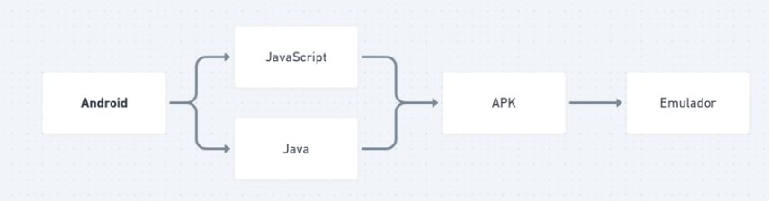
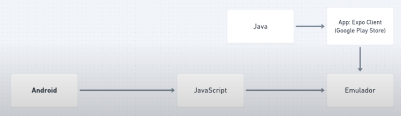

# Mobile

## Conceitos do React Native

<table>
  <tr>
    <td></td>
    <td><</td>
  </tr>
</table>

---

## Por que vamos usar o Expo

É uma ferramenta que traz várias funcionalidades dentro de uma aplicação mobile prontas para já utilizar.

### Vantagens

* Para testar meu aplicativo utilizando Expo eu não preciso instalar nenhuma SDK

### Desvantagens

* Se necessitarmos usar alguma API que o Expo ainda não suporte (Bluetooth) é necessário fazer o eject

### Como funciona

<table>
  <tr>
    <td></td>
    <td><</td>
  </tr>
</table>

### Como saber quais funcionalidades o Expo não suporta

Basta acessar o seguinte [link](https://expo.canny.io/)

---

## Instalar Expo CLI

```bash
npm install -g expo-cli
```

---

## Criar projeto com Expo

```bash
expo init nome_projeto
```
